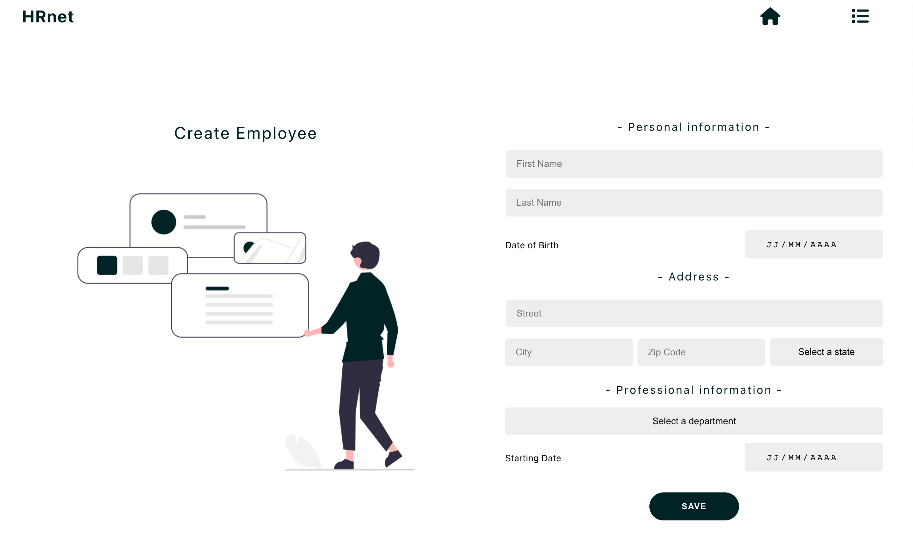
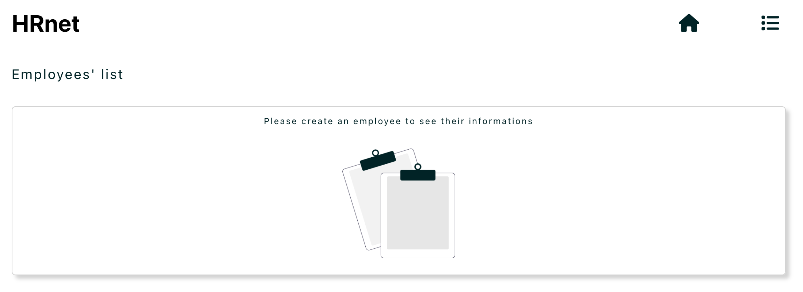
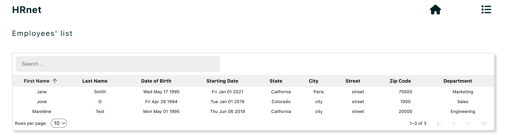
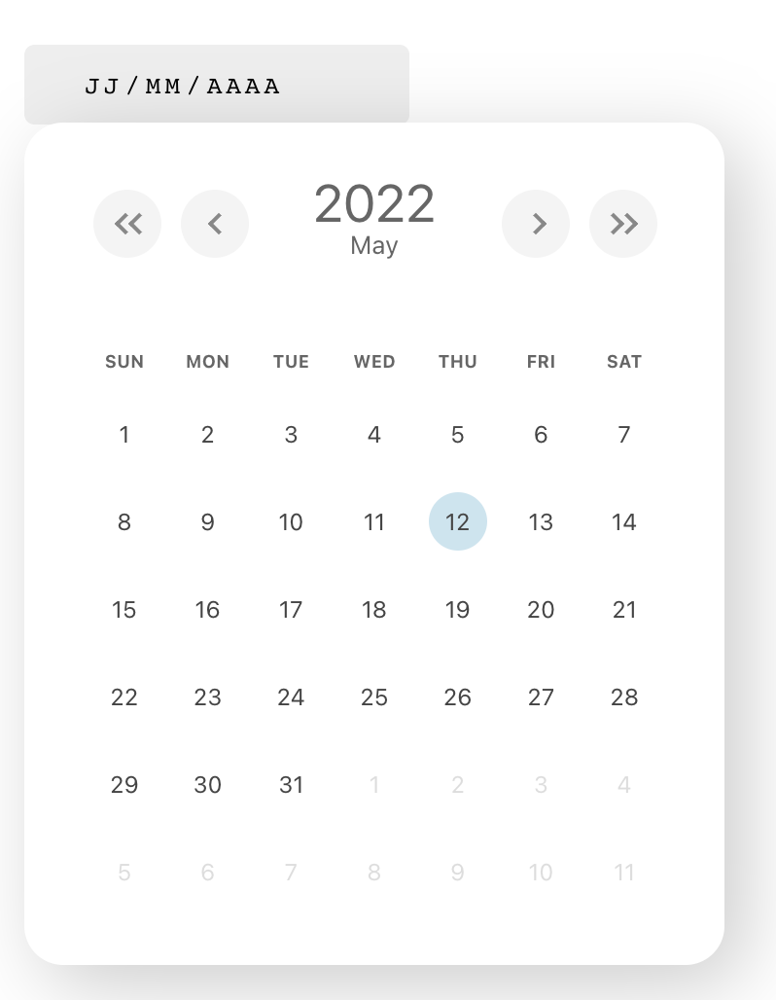

# RHNET

This repository contains all the source code to run the micro front for the application RHNET.

## 1. Prerequisites

- NodeJS (v14.15.1)
- Yarn or npm

## 2. Launch the project

- Fork the **[Front-End repository](https://github.com/Flower-dev/Flore_Malonda_P14_06042022)**.
- Clone it on your computer.

### 2.1 Front End

- This project was bootstrapped with Create React App.
- useContext

**Start the front-end**
```bash
    npm start
```

- Install dependencies
```bash
    npm install
```
Your server should now be running at http://locahost:3000








This project uses a simple and reusable Datepicker component.

- **documentation** : https://www.npmjs.com/package/datepickerplugin


The package can be installed via **npm**

```bash
npm install datepickerplugin --save
```

Or via **yarn**

```bash
yarn add datepickerplugin
```

